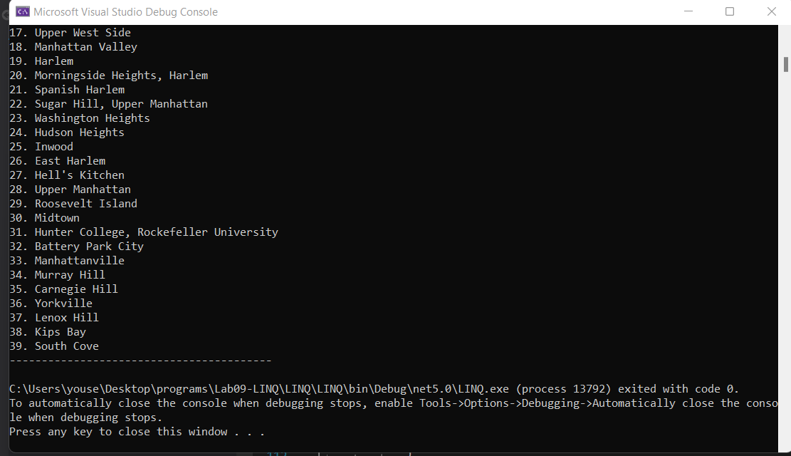

# Lab09-LINQ
# Summary :

this program give you the ability to read data from a json file and filter the neighborhoods whith several ways.

this Program have some useful queries that used for several filters :

1. print all of the neighborhoods in data.
2.a Filter that will filter the neighborhoods that have no names.
3.a Filter that will filter the neighborhoods that have no names and remove all duplicates.
4.consolidate all into one single query.
5.Rewrite the query with LINQ method.

## RUN :

